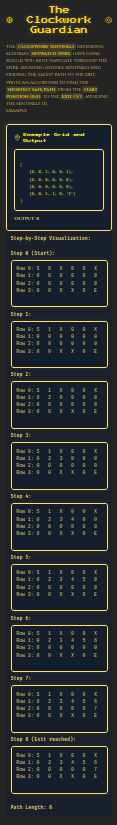

# Cyber Apocalypse CTF 2025: Tales from Eldoria

## ClockWork Gurdian
> The Clockwork Sentinels defending Eldoria’s Skywatch Spire have gone rogue! You must navigate the spire, avoiding hostile sentinels and finding the safest path.


- **Category**: Coding 
- **Difficulty**: Very Easy
- **Author**: Alexct549

## Writeup

Last one let me steal it quickly before my teammate does it 😎



SHORTEST PATH GANG 🔥🔥🔥🔥🔥🔥


```python
import json

def find_shortest_path(grid_str):
    grid_str = grid_str.replace(" ", "").replace("'", '"')
    grid = json.loads(grid_str)
    rows, cols = len(grid), len(grid[0])
    exit_pos = None
    for i in range(rows):
        for j in range(cols):
            if grid[i][j] == 'E':
                exit_pos = (i, j)
                break
        if exit_pos:
            break
    
    queue = [(0, 0, 0)]  
    visited = {(0, 0)}
    dirs = [(-1, 0), (0, 1), (1, 0), (0, -1)]  

    while queue:
        r, c, steps = queue.pop(0)
        
        if (r, c) == exit_pos:
            return steps
        
        for dr, dc in dirs:
            nr, nc = r + dr, c + dc
            if (0 <= nr < rows and 
                0 <= nc < cols and 
                (nr, nc) not in visited and 
                grid[nr][nc] != 1):
                visited.add((nr, nc))
                queue.append((nr, nc, steps + 1))
    
    return -1

# Example
input_str = input()
print(find_shortest_path(input_str))
```

> HTB{CL0CKW0RK_GU4RD14N_OF_SKYW4TCH_e4cc51b6c17b596a87744c83c9cdc0a8}