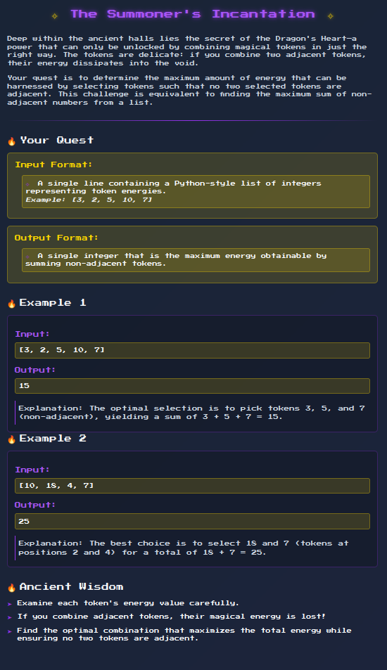

# Cyber Apocalypse CTF 2025: Tales from Eldoria

## Summoners Incantation
> To awaken the ancient power of the Dragon's Heart, the summoners must combine magical incantation tokens. However, the tokens are delicate; no two adjacent tokens can be combined without losing their energy. The optimal incantation is the maximum sum obtainable by choosing non-adjacent tokens


- **Category**: Coding 
- **Difficulty**: Very Easy
- **Author**: Alexct549

## Writeup

I don't have time for this let's dive quickly 



Ok yada yada yada or you take all the pair or you take all the odds the bigger the better (may be a wrong assumption i forgot honestly)

Now there are 2 approach the easy and the "I forgot how to read and i could've done it a bit faster" way, personally i choosed the second 😁

```python
import ast
input_text = input()
input_text = ast.literal_eval(input_text)

def max_non_adjacent_sum(nums):
    if not nums:
        return 0
    if len(nums) == 1:
        return nums[0]
    dp = [0] * len(nums)
    dp[0] = nums[0]
    dp[1] = max(nums[0], nums[1])
    for i in range(2, len(nums)):
        dp[i] = max(dp[i-1], dp[i-2] + nums[i])
    return dp[-1]

result = max_non_adjacent_sum(input_text)
print(result)
```

> HTB{SUMM0N3RS_INC4NT4T10N_R3S0LV3D_a7c537ff60949a5bf1a9945369bb50e3}