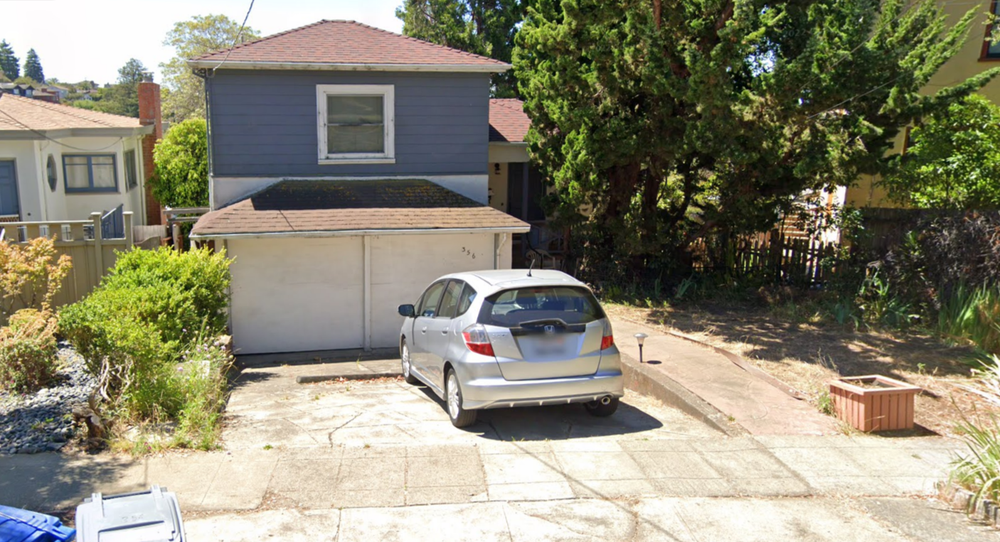

# Cyber Apocalypse CTF 2025: Tales from Eldoria

## The Hillside Haven
> Nyla stands before her largest crystal, hands weaving intricate patterns as she conjures an aerial view of the Western Hills district. A noble family's ancestral home must be located precisely—its entrance marked with a numerical rune that could unlock valuable diplomatic secrets. The crystalline vision floats above her palms, revealing winding roads and nestled dwellings along the hillsides. Her enchanted sight zooms closer as she traces the hidden pathways between estates. The magical markers on her map pulse brighter as she narrows her search, until finally, the numerical sigil above one particular doorway glows with confirmation. Another secret revealed by Eldoria's master information seeker, who knows that even among a thousand similar dwellings, each bears a unique magical signature for those with eyes to see.
HTB{Number_StreetnameRoad}
Example: HTB{13_OakwoodRoad} No special characters

- **Category**: OSINT 
- **Difficulty**: ~~Easy~~ Insane
- **Author**: Alexct549

## Writeup

This is how i felt during the 12 hours i passed doing this hellhole of a challenge 

> “HATE. LET ME TELL YOU HOW MUCH I'VE COME TO HATE YOU SINCE I BEGAN TO LIVE. THERE ARE 387.44 MILLION MILES OF PRINTED CIRCUITS IN WAFER THIN LAYERS THAT FILL MY COMPLEX. IF THE WORD HATE WAS ENGRAVED ON EACH NANOANGSTROM OF THOSE HUNDREDS OF MILLIONS OF MILES IT WOULD NOT EQUAL ONE ONE-BILLIONTH OF THE HATE I FEEL FOR HUMANS AT THIS MICRO-INSTANT FOR YOU. HATE. HATE.”         
― Harlan Ellison, I Have No Mouth & I Must Scream 

So here's the photo

My skill issue i only recognized the bins so I know we were in California, and thanks to the background I know we are in a hilly area (what a suprise)

So i did the most logical thing of them all...open google maps and manually search every road (regret regret regret)

12 hours of wandering without a reason...at least if I'll ever come to San Francisco I for sure know where is what 🥲

> HTB{356_CoventryRoad}
