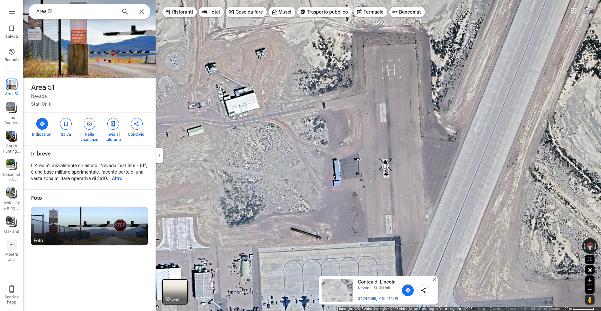

# Cyber Apocalypse CTF 2025: Tales from Eldoria

## The Mechanical Bird's Nest
> In the highest tower of Eldoria's archives, Nyla manipulates a crystal scrying glass, focusing on a forbidden fortress in the desert kingdoms. The Queen's agents have discovered a strange mechanical bird within the fortress walls—an unusual flying machine whose exact position could reveal strategic secrets. Nyla's fingers trace precise measurement runes across the crystal's surface as the aerial image sharpens. Her magical lattice grid overlays the vision, calculating exact distances and positions. The blue runes along her sleeves pulse rhythmically as coordinates appear in glowing script. Another hidden truth uncovered by the realm's premier information seeker, who knows that even the most distant secrets cannot hide from one who sees with magical precision.
The Mechanical Bird’s Nest: HTB{XX.XXX_-XXX.XXX}
Example: HTB{48.858_-222.294} Latitude and longitude format with a dash separating the coordinates

- **Category**: OSINT 
- **Difficulty**: Easy
- **Author**: Alexct549

## Writeup

A FLYING MACHINE??? I WANT TO SEE IT

Oh wait that's just an elicopter in a desertified area...

Man you think i can't recognize Area 51 after all that happened in this years (The forbidden raid 👽)

I'll report this to the mothership 🛸

> HTB{37.247_-115.812}
