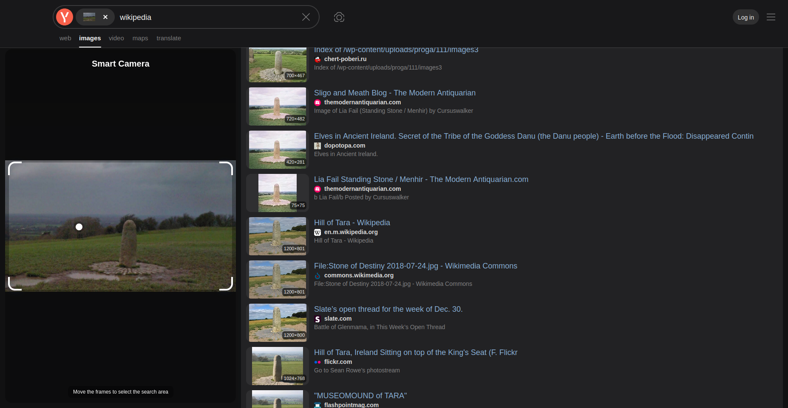

# Cyber Apocalypse CTF 2025: Tales from Eldoria

## The Stone That Whispers
> In the twilight archives of Eldoria, Nyla studies an image of a mysterious monument. Her enchanted crystals glow as she traces ancient maps with rune-covered fingers. The stone atop the hill of kings calls to her, its secrets hidden in scattered records across realms. As her magical threads of knowledge connect, the true name emerges in glowing script: "The Stone of Destiny." Another mystery solved by the realm's most skilled information seeker, who knows that every artifact leaves traces for those who can read the signs.
HTB{Name_Object}
Example: HTB{Pia_Pail} No special characters

- **Category**: OSINT 
- **Difficulty**: Very Easy
- **Author**: Alexct549

## Writeup

Another stone...really? 😒

Let me call my friend he's a geologist

Bruh my friend can't evene recognize a stupid rock, better call yandex again

Guaranteed success! 🙏

> HTB{Lia_Fail}
