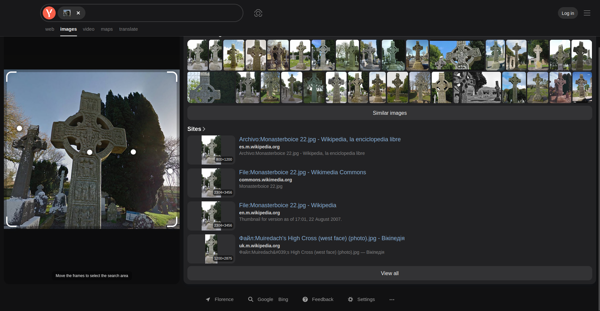

# Cyber Apocalypse CTF 2025: Tales from Eldoria

## Echoes in Stone
> In the twilight archives of Eldoria, Nyla studies an image of an ancient Celtic cross. Her enchanted crystals illuminate the intricate carvings as she searches through forgotten tomes. The cross stands at a crossroads of realms and time, its weathered surface telling tales older than Eldoria itself. As her magical threads of knowledge connect across centuries, the true name of the monument emerges in glowing script before her eyes. Another mystery solved by the realm's most skilled information seeker, who knows that even stone can speak to those who know how to listen.
HTB{Name_High_Cross}
Example: HTB{Kells_High_Cross} No special characters and avoid using the letter 's

- **Category**: OSINT 
- **Difficulty**: Very Easy
- **Author**: Alexct549

## Writeup

First of all let's have a look at what are we working with

Well what a pretty cross we have here, will yandex spot it?

Yep! 😁

> HTB{Muiredach_High_Cross}