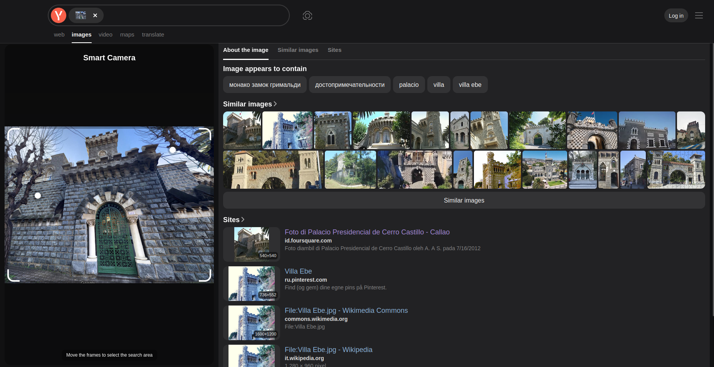
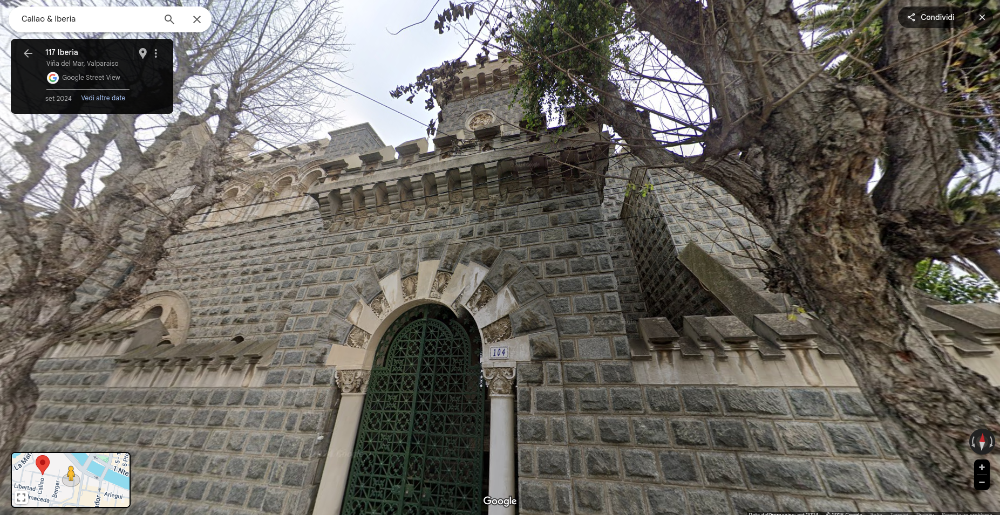

# Cyber Apocalypse CTF 2025: Tales from Eldoria

## The Ancient Citadel
> Deep in her sanctum beneath Eldoria's streets, Nyla arranges seven crystalline orbs in a perfect circle. Each contains a different vision of stone battlements and weathered walls—possible matches for the mysterious fortress the Queen seeks in the southern kingdoms of Chile. The image in her central crystal pulses with ancient power, showing a majestic citadel hidden among the distant Chilean mountains. Her fingers dance across each comparison crystal, her enchanted sight noting subtle architectural differences between the visions. The runes along her sleeves glow more intensely with each elimination until only one crystal remains illuminated. As she focuses her magical threads on this final vision, precise location runes appear in glowing script around the orb. Nyla smiles in satisfaction as the fortress reveals not just its position, but its true name and history. A more challenging mystery solved by Eldoria's premier information seeker, who knows that even the most distant fortifications cannot hide their secrets from one who compares the patterns of stone and shadow.
HTB{street_number_exactzipcode_city_with_underscores_region}
Example: HTB{Libertad_102_2520000_Viña_del_Mar_Valparaíso} Use underscores between words and include special characters where appropriate

- **Category**: OSINT 
- **Difficulty**: Medium
- **Author**: Alexct549

## Writeup

Yo that's a cool castle i wonder where it is 🤔

YANDEX ASSEMBLE 🤖

Good job yandex let me roam the streets a bit...

Medium huh? 😂

> HTB{Iberia_104_2571409_Viña_del_Mar_Valparaíso}
